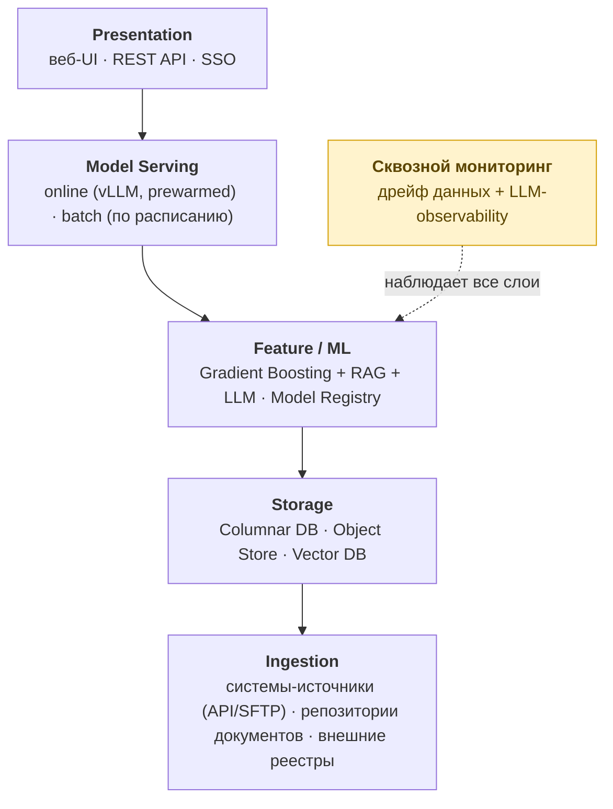

# AI-платформа оценки рисков и проверки документов в регулируемой среде

**Архитектурная концепция (design study).** Документ описывает проектные решения для системы поддержки принятия решений в закрытом регулируемом контуре: оценка риска по сущности/документу, доказательная проверка по корпусу документов, генерация обоснования с юридической значимостью. Это **проектная концепция архитектуры**, а не описание развёрнутой production-системы.

Цель публикации — показать подход к проектированию AI-архитектуры end-to-end в среде с жёсткими требованиями к объяснимости, к решениям с юридическими последствиями и к защищённому контуру. **Рабочая методика скоринга (конкретные признаки риска, их веса, операционные пороги и логика приоритизации) сознательно не публикуется** — см. раздел [«Что намеренно не раскрыто»](#что-намеренно-не-раскрыто).

---

## 1. Задача

Система обрабатывает поток разнородных документов и связанных с ними структурированных данных и по каждой сущности выдаёт:

- **класс рекомендации** (например: типовое решение / требует эскалации / нестандартный сценарий / неприменимо) и **калиброванную вероятность** по каждому классу;
- **обоснование** со ссылками на конкретные фрагменты документов и применимые нормы;
- результат в **двух уровнях детализации**: единый балл для скорости в списке и структурированная карточка дела для глубины.

Балл — **производное от карточки** по утверждённому правилу, а не отдельная модель. Это исключает рассогласование «балл говорит одно, карточка — другое».

Ключевые ограничения среды, которые формируют архитектуру с самого начала:

- решения **затрагивают права субъекта** → запрет на чисто автоматизированные решения (ст. 16 152-ФЗ), обязанность разъяснить порядок принятия решения и обеспечить возможность возражения;
- **закрытый контур** → запрет внешних облачных API, только on-prem из сертифицированных/импортозамещённых компонентов;
- **запрет тихих изменений** поведения системы с юридическими последствиями → отказ от автоматического переобучения.

---

## 2. Общая архитектура

Шесть логических слоёв со сквозным контуром мониторинга. Деление подчинено главному ограничению: система должна поддерживаться небольшой командой.

**Два контура исполнения** — пакетный (массовый ночной прогон) и онлайн (запрос по требованию, SLA p95 ≤ 5 c). Главный риск двухконтурной схемы — расхождение результатов — снимается архитектурно: оба контура используют **одну версию модели из общего реестра** и одну библиотеку подготовки признаков; различие — только в исполнителе.

**Отвергнутые на этом уровне альтернативы** (с обоснованием в полной концепции): монолит (несовместимое масштабирование batch/online, риск выкатки), чистые микросервисы (7+ сетевых вызовов на одну рекомендацию съедают SLA; команда не вытянет в проде), shared-database между источником и платформой (скрытая связанность, нарушение периметра).

---

## 3. ML-подход: композиция трёх моделей

Сквозная LLM, принимающая решение по сырому входу, — **неверный выбор** для среды с юридическими последствиями. В системе три специализированные модели с разделением ответственности:

| Компонент | Роль | Почему так |
|---|---|---|
| **Gradient Boosting** | Принимает решение (класс + вероятность) | Объяснимость через SHAP; калиброванные вероятности; обучение — часы на CPU; масштабируемый пакетный прогон |
| **RAG** | Достаёт доказательную базу (релевантные фрагменты) | Цитаты привязаны к источнику; двухступенчатый поиск (retrieval → reranker) |
| **LLM** | Генерирует текст обоснования, **решение не принимает** | Облекает уже принятое решение в человеческую форму строго по поданным фрагментам |

**Почему бустинг, а не нейросеть/LLM как ядро:**
- **Объяснимость.** SHAP даёт математически корректную (теорема Шепли, аддитивную) декомпозицию вклада каждого признака — это закрывает обязанность разъяснить порядок принятия решения. У больших нейросетей/LLM такой объяснимости нет.
- **Калибровка.** Когда модель говорит 0.78 — это интерпретируется как реальная частота. LLM системно переуверены, что критично для решений с последствиями.
- **Стоимость и скорость.** Реалистичный массовый прогон без выделенного GPU-кластера.

### Объединение структурированных и текстовых данных

Тексты превращаются в числа и подаются **в одну общую таблицу** к структурированным признакам, а не обрабатываются отдельной моделью:

- **NER** извлекает сущности, суммы, ссылки на нормы;
- **LLM-классификация фрагментов** отвечает «да/нет/не указано» на заранее заданные вопросы → бинарные флаги;
- **агрегаты** по сущности.

Почему это лучше двух отдельных моделей: одна точка объяснения (единый SHAP-список причин вместо «модель A думает так, модель B иначе»); дешевле (один бустинг против двух моделей + ансамбль); проверенный в индустрии подход. Минус — частичная потеря информации из текстов; для решений с юридическими последствиями надёжность и объяснимость важнее теоретического максимума качества.

### Ключевое методологическое решение: целевая переменная

Обучение **на исторических решениях специалистов** — серьёзная методологическая ошибка: модель воспроизведёт и заморозит все смещения существующей практики. Правильная целевая переменная — **фактический исход** (объективный, наблюдаемый результат), не зависящий от качества прошлых решений. Это центральный выбор всей концепции.

---

## 4. Объяснимость и решения с юридическими последствиями

Обоснование собирается из **трёх независимых источников**:

1. **SHAP** — какие признаки и насколько повлияли (математическая гарантия корректности, не «модель сама себе придумала объяснение»);
2. **RAG** — конкретные цитаты со ссылкой на источник;
3. **LLM** — сборка в связный текст.

**Обязательная защита от галлюцинаций:** каждая цитата в сгенерированном тексте проверяется на **буквальное совпадение** с поданным фрагментом. Не совпала — текст блокируется и заменяется шаблонным обоснованием на базе SHAP, инцидент пишется в лог.

**Дифференцированный режим работы** — следствие ст. 16 152-ФЗ:
- **Автоматический конвейер** — только для узкого подмножества (типовой бесспорный класс + высокая уверенность + ограничение по «весу» решения), с типовой формой уведомления субъекта и журналированием версии модели, факторов и ответственного лица.
- **Утверждение специалистом** — всё остальное: система готовит проект решения и обоснование, человек подтверждает/правит/отклоняет. Правки и отклонения — структурированная обратная связь для следующей версии модели.

Граница между режимами — **управляемый параметр** (без переобучения), что позволяет начинать осторожно и расширять зону автоматики по мере накопления статистики.

**Обработка расхождения источников** (явные сценарии, а не молчаливый отказ): слабая релевантность RAG-цитат → флаг ручной проверки; галлюцинация LLM → блокировка текста; низкая уверенность модели → маршрутизация на ручную проработку; расхождение SHAP и RAG → флаг «решение основано преимущественно на структурированных признаках».

---

## 5. Работа с разнородными документами

Главная оговорка, меняющая приоритеты команды: **бóльшая часть потока — электронные документы** (структурированные API-ответы, PDF с текстовым слоем), а не сканы. Поэтому главная задача — **структурный парсинг электронных форматов**, а OCR — вторичная, хоть и критичная задача на меньшинстве потока.

- **OCR — двухуровневая стратегия:** основной open-source движок с дообучением на доменных страницах; резервный сертифицированный движок для страниц с низкой уверенностью.
- **Чанкинг:** фиксированный размер с перекрытием как база; структурное разрезание документов по логическим разделам там, где замеры показывают выигрыш. Семантический чанкинг отвергнут (на больших корпусах — недопустимо дорог по времени индексации).
- **Поиск (RAG):** двухступенчатый — векторная модель находит топ-кандидатов, реранкер уточняет топ. Русскоязычные эмбеддинг-модели (производные bge-m3 и аналоги), on-prem LLM (GigaChat / открытые русские модели) — выбор после замеров на собственном gold-наборе.

### Два независимых конвейера обработки документа

Документ используется дважды, и это **разные** использования:

| Аспект | Конвейер признаков | Конвейер поиска |
|---|---|---|
| Когда | На индексации | Онлайн, по запросу |
| Результат | Столбцы признаков в Columnar DB | Векторы в Vector DB |
| Потребитель | Gradient Boosting | LLM |
| Стабильность | Высокая (изменение = переобучение) | Может меняться часто |

Почему разделение проговорено явно: сведение всего к эмбеддингам («храним вектора, по ним ищем и предсказываем») работает в прототипе и ломается в проде — эмбеддинги слабые признаки для табличной модели и теряют интерпретируемость (через SHAP нельзя осмысленно объяснить вклад координаты вектора).

---

## 6. Качество и мониторинг

**Эталон** = фактический исход (объективная целевая переменная) + экспертно размеченный **gold-набор** для приёмки версий модели. Каждая новая версия даёт качество не хуже предыдущей на gold-наборе.

**Четырёхуровневые метрики** (позволяют локализовать проблему при деградации):

| Уровень | Примеры метрик | Ориентир |
|---|---|---|
| Модель | ROC-AUC, F1, калибровка (ECE) | AUC ≥ 0.85, ECE ≤ 0.05 |
| RAG | Recall@k, MRR | Recall@10 ≥ 0.80 |
| LLM | Faithfulness, доля корректных цитат | 100% по постпроверке |
| Бизнес | Доля рекомендаций без правок, скорость обработки | задаётся по проекту |

**Мониторинг дрейфа** — self-hosted, в закрытом контуре: распределение входных признаков (еженедельно), качество на свежих данных с фактическими метками (ежемесячно), стабильность важности признаков (ежеквартально). **Сезонная корректировка** порогов дрейфа — иначе детектор даёт ложные срабатывания на сезонных сдвигах распределения.

**Реакция на дрейф — формальная, не автоматическая.** Никакого continuous learning: переобучение — формальное событие с тестированием на gold-наборе, приёмкой и подписью ответственного. Это требование среды с юридическими последствиями.

---

## 7. Технологический стек

Принцип выбора: защищаемость на приёмке (сертифицированные/импортозамещённые компоненты), срок до первого результата, операционная нагрузка на небольшую команду, открытые лицензии.

- **Хранилища:** колоночная СУБД (признаки, история) + объектное хранилище (документы) + векторная БД. Гибрид выбран против чистого lakehouse (свежо для регулируемого контура, аналитический движок не держит онлайн-SLA, команда не вытянет) и чистого DWH с витринами (деградирует с появлением новых сценариев; документы/эмбеддинги не ложатся в схему).
- **ML/Serving:** gradient boosting, RAG-оркестрация, реестр и версионирование моделей, online-инференс (vLLM) + batch по расписанию.
- **Мониторинг:** дрейф данных/качества + LLM-observability, self-hosted.
- **Контур:** on-prem, закрытый, без внешних облачных API; нормативная база — лицензированная offline-поставка с регулярной актуализацией и локальной индексацией.

---

## 8. Что намеренно не раскрыто

Это публичная версия архитектурной концепции. Сознательно **исключено** как чувствительное и/или создающее возможность обхода системы:

- конкретный набор **признаков риска** и их **веса**;
- **операционные пороги** и логика приоритизации;
- привязка к конкретному заказчику, домену, системам-источникам и нормативной специфике;
- рабочие промпты, разметка NER, полный перечень признаков.

Ограничение раскрытия — стандартная практика для систем оценки риска: при полном раскрытии методики квалифицированный субъект подстраивает поведение под признаки. Полная детализация доступна только методисту и регулятору в проектной документации, не публично. **Понимание того, что безопасно публиковать, а что нет, — часть архитектурной компетенции.**

---

## 9. Иллюстративный сквозной пример (без методики)

> Демонстрирует поток, не раскрывает признаки/веса.

1. **Признаки.** Модель получает таблицу: структурированные поля + признаки, извлечённые из документов (NER + LLM-классификация фрагментов + агрегаты). *Конкретный состав и веса не приводятся.*
2. **Решение.** Бустинг выдаёт класс рекомендации и калиброванную вероятность.
3. **SHAP.** Раскладывает вероятность на вклад признаков (базовая вероятность по датасету + вклады). *Здесь — как возможность, без реальных факторов.*
4. **RAG.** Двухступенчатый поиск достаёт релевантные фрагменты-доказательства со ссылкой на источник.
5. **LLM.** Собирает обоснование строго по поданным фрагментам; каждая цитата проходит постпроверку на буквальное совпадение.
6. **Карточка.** Балл + класс + применимая норма + цитаты с возможностью открыть оригинал; по клику — полная SHAP-разборка.

---

## Резюме архитектуры

Композиция **Gradient Boosting (решение) + RAG (доказательства) + LLM (обоснование)** с явным разделением ответственности; единая таблица структурированных и текстовых признаков; целевая переменная — фактический исход, не историческое решение; трёхисточниковая объяснимость с постпроверкой цитат; дифференцированный режим автоматизации под ст. 16 152-ФЗ; два контура исполнения с общим реестром моделей; формальный, не автоматический цикл переобучения.

---

*Архитектурная концепция. Домен нейтрализован, рабочая методика исключена. Подготовлено как портфолио-артефакт, демонстрирующий подход к проектированию AI-систем в регулируемой среде.*
